# Resonance Graph

Local-first GraphRAG for approved podcasts and videos.

Resonance Graph downloads legally approved YouTube videos, extracts and transcribes the audio locally, chunks timestamped transcript segments, generates local embeddings with Ollama, stores the transcript graph and vectors in Neo4j, and answers questions with timestamp citations.

The project is intentionally transcript-first. The code is structured so frame extraction, OCR, local vision captions, richer graph extraction, API routes, and a fuller UI can be added later without replacing the core ingestion and retrieval pipeline.

## Legal Boundary

Only use Resonance Graph with videos that you own, have permission to process, are Creative Commons/public-domain, or are otherwise legally allowed to download and analyze.

This project does not support bypassing DRM, paywalls, private videos, login-only videos, region restrictions, or platform protections. Do not use it for content you are not authorized to download or process.

## Features

- Single approved YouTube video ingestion.
- Approved YouTube channel ingestion for long-form videos while excluding Shorts.
- Stage-pipelined channel ingestion with bounded download, audio, caption, ingest, and local transcription lanes.
- Download caching with `yt-dlp` archive support.
- 16 kHz mono WAV extraction with FFmpeg.
- YouTube captions first when available, with local transcription as the quality pass.
- Detached local transcription and caption/local merge jobs after the fast caption pass.
- Local transcription with `whisper.cpp` Metal preferred on Mac, with `faster-whisper` fallback.
- Timestamp-preserving transcript chunks.
- Local embeddings through Ollama.
- Neo4j graph storage with vector search.
- Generic YouTube metadata role extraction for publishers, uploaders, creators, and evidence-backed possible hosts/guests.
- Local RAG answers with timestamp citations.
- Minimal local web app for ingestion, search, graph visualization, and admin actions.
- CLI for repeatable workflows.
- Benchmark harness for retrieval, answer, citation, and latency metrics.
- Offline unit tests for config, chunking, models, prompts, retrieval formatting, and YouTube metadata parsing.

## What It Does Not Do Yet

- Frame extraction.
- OCR.
- Vision captions.
- Entity, topic, or claim extraction.
- Hybrid vector plus graph traversal retrieval.
- Speaker diarization.
- Playlist ingestion.
- FastAPI backend.
- Natural-language-to-Cypher.
- Multi-user auth or hosted deployment.

## Architecture

For a deeper implementation map, see [docs/ARCHITECTURE.md](docs/ARCHITECTURE.md).
For benchmarking and accuracy testing, see [docs/BENCHMARKING.md](docs/BENCHMARKING.md).

```mermaid
flowchart LR
  A["Approved YouTube URL or channel"] --> M["Metadata + YouTube captions"]
  M -->|captions-first fast path| E["Transcript chunking"]
  M -.->|download when needed| B["yt-dlp downloader"]
  B --> C["FFmpeg audio extraction"]
  C --> D["Local transcription<br/>whisper.cpp / faster-whisper"]
  D --> U["Merge transcripts<br/>background worker"]
  U --> E
  E --> F["Ollama embeddings"]
  F --> G["Neo4j graph + vector index"]

  H["User question"] --> I["Question embedding"]
  I --> G
  G --> J["Vector candidates"]
  J --> R["Local reranking"]
  R --> K["Ollama answer generation"]
  K --> L["Answer with timestamp citations"]
```



Core graph labels:

- `Source`
- `Episode`
- `TranscriptSegment`
- `Chunk`
- `RoleCandidate`
- `Person`

Core relationships:

- `(:Source)-[:HAS_EPISODE]->(:Episode)`
- `(:Episode)-[:HAS_CHUNK]->(:Chunk)`
- `(:Episode)-[:HAS_SEGMENT]->(:TranscriptSegment)`
- `(:Chunk)-[:CONTAINS_SEGMENT]->(:TranscriptSegment)`
- `(:Episode)-[:HAS_ROLE_CANDIDATE]->(:RoleCandidate)`
- `(:RoleCandidate)-[:REFERS_TO]->(:Person)`

Role candidates are generic and evidence-backed. YouTube channel/uploader/creator fields are stored as their real metadata roles. Host or guest roles are only added when a reusable title, description, or transcript-intro pattern supports them, and uncertain roles are stored as `possible_host` or `possible_guest`.

## Requirements

- Python 3.11+
- Docker and Docker Compose
- Neo4j Community Edition through `docker-compose.yml`
- Ollama
- FFmpeg
- `yt-dlp`
- `whisper.cpp` with Metal support recommended on Mac
- `faster-whisper` fallback for local transcription

## Quick Start

```bash
python -m venv .venv
source .venv/bin/activate
pip install -e ".[transcription,dev]"
cp .env.example .env
docker compose up -d
ollama pull nomic-embed-text
ollama pull llama3.1:8b
resonance status
resonance setup-db
resonance ingest-url "https://www.youtube.com/watch?v=VIDEO_ID"
resonance ask "What is this video about?" --show-context
```

Use `python3` instead of `python` on systems where `python` is not available.

Legacy command aliases are still included:

```bash
podcast-graphrag status
podcast-graphrag-web
```

## Local Website

Start the web app:

```bash
resonance-web
```

Open:

```text
http://127.0.0.1:8766
```

The website supports:

- Service status checks.
- Neo4j schema setup.
- Single-video ingestion.
- Channel preview and long-form channel ingestion.
- Transcript RAG questions.
- Episode-scoped questions so answers can be limited to one selected video.
- Episode browsing.
- Neo4j graph visualization.
- Graph reset.
- Local cache clearing.

## Configuration

Configuration is loaded from `.env`. You can also set `APP_CONFIG_FILE` to a YAML or TOML file.

Important settings:

```env
NEO4J_URI=bolt://localhost:7687
NEO4J_USERNAME=neo4j
NEO4J_PASSWORD=local-graphrag-password
OLLAMA_BASE_URL=http://localhost:11434
OLLAMA_CHAT_MODEL=llama3.1:8b
OLLAMA_EMBEDDING_MODEL=nomic-embed-text
OLLAMA_TEMPERATURE=0.1
OLLAMA_TOP_P=0.9
OLLAMA_TOP_K=40
OLLAMA_REPEAT_PENALTY=1.1
OLLAMA_NUM_CTX=8192
OLLAMA_NUM_PREDICT=700
OLLAMA_SEED=7
YOUTUBE_DOWNLOAD_DIR=data/youtube
AUDIO_OUTPUT_DIR=data/audio
TRANSCRIPT_OUTPUT_DIR=data/transcripts
CHUNK_OUTPUT_DIR=data/chunks
EMBEDDING_CACHE_DIR=data/embeddings
JOB_OUTPUT_DIR=data/jobs
MODEL_CACHE_DIR=data/models
CHUNK_SIZE=900
CHUNK_OVERLAP=200
RETRIEVAL_TOP_K=8
RETRIEVAL_CANDIDATE_TOP_K=20
MAX_YOUTUBE_RESOLUTION=720
CHANNEL_MIN_VIDEO_DURATION_SECONDS=61
CHANNEL_MAX_VIDEOS=0
PIPELINE_DOWNLOAD_WORKERS=2
PIPELINE_AUDIO_WORKERS=2
PIPELINE_CAPTION_WORKERS=3
PIPELINE_INGEST_WORKERS=1
PIPELINE_LOCAL_WORKERS=1
TRANSCRIPTION_BACKEND=faster-whisper
TRANSCRIPT_FAST_PATH=youtube_captions
BACKGROUND_LOCAL_TRANSCRIPTION=true
LOCAL_TRANSCRIPTION_BACKEND=whisper_cpp_metal
WHISPER_MODEL_SIZE=base
TRANSCRIPT_MERGE_STRATEGY=time_overlap_best_text
FASTER_WHISPER_MODEL=base
FASTER_WHISPER_DEVICE=cpu
FASTER_WHISPER_COMPUTE_TYPE=int8
WHISPER_CPP_BINARY=whisper-cli
WHISPER_CPP_MODEL=data/models/whisper.cpp/ggml-base.bin
```

## Neo4j Setup

Start Neo4j:

```bash
docker compose up -d
```

Open Neo4j Browser:

```text
http://localhost:7474
```

Default local credentials:

```text
username: neo4j
password: local-graphrag-password
```

Create constraints, indexes, and the chunk vector index:

```bash
resonance setup-db
```

## Ollama Setup

Install and start Ollama, then pull the configured models:

```bash
ollama pull nomic-embed-text
ollama pull llama3.1:8b
```

You can change the models in `.env`:

```env
OLLAMA_CHAT_MODEL=llama3.1:8b
OLLAMA_EMBEDDING_MODEL=nomic-embed-text
```

## FFmpeg Setup

The app uses system `ffmpeg` when available. The Python package also includes an `imageio-ffmpeg` fallback so the CLI can run in a self-contained virtual environment.

macOS with Homebrew:

```bash
brew install ffmpeg
```

Ubuntu/Debian:

```bash
sudo apt-get update
sudo apt-get install ffmpeg
```

## Transcription Setup

Recommended Mac backend:

```env
TRANSCRIPT_FAST_PATH=youtube_captions
BACKGROUND_LOCAL_TRANSCRIPTION=true
LOCAL_TRANSCRIPTION_BACKEND=whisper_cpp_metal
WHISPER_MODEL_SIZE=base
WHISPER_CPP_BINARY=whisper-cli
WHISPER_CPP_MODEL=data/models/whisper.cpp/ggml-base.bin
```

With this setup, Resonance Graph ingests YouTube captions first when available, then queues a detached local Whisper job. The caption transcript becomes searchable quickly as `caption_ready`; when the local pass finishes, the worker merges local Whisper with captions, re-chunks, re-embeds, updates Neo4j, and marks the episode `merged_ready`.

Fallback backend:

```env
TRANSCRIPTION_BACKEND=faster-whisper
FASTER_WHISPER_MODEL=base
FASTER_WHISPER_DEVICE=cpu
FASTER_WHISPER_COMPUTE_TYPE=int8
```

Install with:

```bash
pip install -e ".[transcription]"
```

Optional `whisper.cpp` backend:

```env
TRANSCRIPTION_BACKEND=whisper.cpp
WHISPER_CPP_BINARY=whisper-cli
WHISPER_CPP_MODEL=/absolute/path/to/ggml-model.bin
```

For the preferred Mac path, compile/install `whisper.cpp` with Metal enabled, keep `LOCAL_TRANSCRIPTION_BACKEND=whisper_cpp_metal`, and point `WHISPER_CPP_MODEL` at the base GGUF/bin model. If that binary or model is unavailable, the app can still use the configured `faster-whisper` fallback.

## CLI Commands

Check local services and tools:

```bash
resonance status
```

Create Neo4j schema:

```bash
resonance setup-db
```

Ingest an approved video with the captions-first pipeline:

```bash
resonance ingest-url "https://www.youtube.com/watch?v=VIDEO_ID"
```

If YouTube captions are available, this returns after the caption graph is searchable and prints a background job id for the local Whisper merge. Media download and local Whisper are deferred until they are needed for transcript improvement or fallback.

Preview long-form videos from an approved channel:

```bash
resonance ingest-channel "https://www.youtube.com/@CHANNEL/videos" --dry-run
```

Ingest long-form videos from an approved channel with the staged pipeline:

```bash
resonance ingest-channel "https://www.youtube.com/@CHANNEL/videos"
```

Limit channel ingestion:

```bash
resonance ingest-channel "https://www.youtube.com/@CHANNEL/videos" --limit 5
```

Ask a question:

```bash
resonance ask "What is this video about?"
```

Ask against one specific episode to avoid mixing videos:

```bash
resonance ask "What is this video about?" --video-id VIDEO_ID
```

Show retrieved context with the answer:

```bash
resonance ask "What is this video about?" --show-context
```

Check detached local transcription/merge jobs:

```bash
resonance background-jobs
resonance background-jobs --job-id JOB_ID
```

Run a benchmark suite:

```bash
resonance benchmark evals/my-safe-benchmark.yaml --output-dir benchmark-results/latest
```

Run retrieval-only benchmark mode:

```bash
resonance benchmark evals/my-safe-benchmark.yaml --retrieval-only
```

List episodes:

```bash
resonance list-episodes
```

Inspect one episode:

```bash
resonance inspect-episode VIDEO_ID
```

Reset graph data:

```bash
resonance reset-db
```

Skip reset confirmation:

```bash
resonance reset-db --yes
```

## Caching And Idempotency

The pipeline is resumable:

- Downloaded video and `yt-dlp` info JSON are stored in `data/youtube/{video_id}/`.
- A `yt-dlp` download archive prevents duplicate downloads.
- Extracted WAV audio is cached in `data/audio/`.
- Transcript JSON is cached in `data/transcripts/`.
- YouTube caption transcripts are cached as `data/transcripts/{video_id}.youtube.transcript.json`.
- Local Whisper transcripts are cached as `data/transcripts/{video_id}.local.transcript.json`.
- Merged transcripts are cached as `data/transcripts/{video_id}.transcript.json`.
- Chunk JSON is cached in `data/chunks/`.
- Embeddings are cached by model and text hash in `data/embeddings/`.
- Local transcription models are cached in `data/models/`.
- Neo4j writes use `MERGE` and uniqueness constraints to avoid duplicate nodes.

Use `--force` on ingestion commands to redo expensive stages.

## Channel Ingestion

`ingest-channel` discovers channel videos first without downloading media. It excludes entries whose URL contains `/shorts/` and entries with a known duration below `CHANNEL_MIN_VIDEO_DURATION_SECONDS`, which defaults to `61` seconds.

Entries with unknown duration are kept unless they are explicit Shorts URLs, because some channel listing responses do not include duration until individual video metadata is fetched.

Channel ingestion uses the staged pipeline by default. It fetches public metadata, checks legally available captions, and makes caption-backed videos searchable before downloading media. Different videos can occupy different stages at the same time, while expensive shared resources stay bounded:

- Metadata lookup is intentionally serialized to reduce YouTube throttling pressure.
- `PIPELINE_DOWNLOAD_WORKERS`: approved media downloads for local fallback or local transcript improvement.
- `PIPELINE_AUDIO_WORKERS`: FFmpeg audio extraction.
- `PIPELINE_CAPTION_WORKERS`: YouTube caption lookup and parsing.
- `PIPELINE_INGEST_WORKERS`: chunking, Ollama embeddings, and Neo4j writes.
- `PIPELINE_LOCAL_WORKERS`: local Whisper fallback for videos without captions.

The default keeps embeddings, graph writes, and local transcription conservative. Large channels can still take a long time because every caption transcript must be embedded and written to Neo4j, and captionless videos still need media download plus local transcription. Use `--dry-run` first, then `--limit N` for a smaller initial import.

## Repository Layout

```text
app/
  audio.py              FFmpeg audio extraction
  channel_pipeline.py   Stage-pipelined channel ingestion runner
  chunking.py           Timestamp-aware transcript chunking
  cli.py                Typer CLI
  config.py             .env/YAML/TOML config loading
  models.py             Pydantic data models
  neo4j_store.py        Neo4j schema, ingestion, retrieval, graph overview
  ollama.py             Ollama embeddings and chat client
  pipeline.py           End-to-end ingestion pipeline
  prompts.py            RAG context and answer prompt formatting
  retrieval.py          Question answering flow
  roles.py              Generic metadata/transcript role candidate extraction
  transcription.py      Local transcription backends
  web.py                Local HTTP app and JSON API
  youtube.py            yt-dlp download and channel discovery
  static/               Browser UI
tests/                  Offline unit tests
docker-compose.yml      Local Neo4j
.env.example            Local configuration template
```

## Development

Install development dependencies:

```bash
pip install -e ".[transcription,dev]"
```

Run tests:

```bash
pytest
```

Run a syntax check:

```bash
python -m compileall app
```

The unit tests intentionally avoid external services. Neo4j, Ollama, YouTube, FFmpeg, and transcription model availability are checked through:

```bash
resonance status
```

## Troubleshooting

`Ollama is not reachable`

Start Ollama and verify `OLLAMA_BASE_URL`. Then run:

```bash
ollama list
```

`Missing Ollama model`

Pull the model named in the error:

```bash
ollama pull nomic-embed-text
ollama pull llama3.1:8b
```

`Neo4j is not reachable`

Start Docker Compose:

```bash
docker compose up -d
```

Then check:

```text
http://localhost:7474
```

`Missing FFmpeg`

Install FFmpeg and ensure `ffmpeg` is on your `PATH`. The project includes an `imageio-ffmpeg` fallback, but system FFmpeg is still recommended.

`faster-whisper is not installed`

Install transcription dependencies:

```bash
pip install -e ".[transcription]"
```

`yt-dlp download failed`

Confirm the URL is public and legally allowed to download. Resonance Graph does not handle private, protected, paywalled, DRM-protected, or login-only videos.

`resonance command not found`

Reinstall the editable package after pulling metadata changes:

```bash
pip install -e ".[transcription,dev]"
```

You can always use:

```bash
python -m app.cli status
```

## Security And Privacy

Resonance Graph is designed for local processing. Videos, audio, transcripts, embeddings, and graph data stay on your machine unless you explicitly move them elsewhere.

Do not commit `.env`, downloaded media, transcripts, embeddings, model files, or Neo4j data. The repository `.gitignore` excludes these local artifacts.

## Roadmap

Future phases:

- Frame extraction from video.
- OCR on frames.
- Local vision model captions through Ollama.
- Frame nodes in Neo4j.
- Linking frames to transcript chunks by timestamp.
- Entity extraction from transcript chunks.
- Topic and claim extraction.
- Knowledge graph relationships between entities.
- Hybrid GraphRAG using vector search plus graph traversal.
- FastAPI backend.
- Local Streamlit or web UI.
- Speaker diarization.
- Playlist/channel ingestion.
- Better reranking.
- Natural-language-to-Cypher with safety restrictions.

## License

MIT. See [LICENSE](LICENSE).
