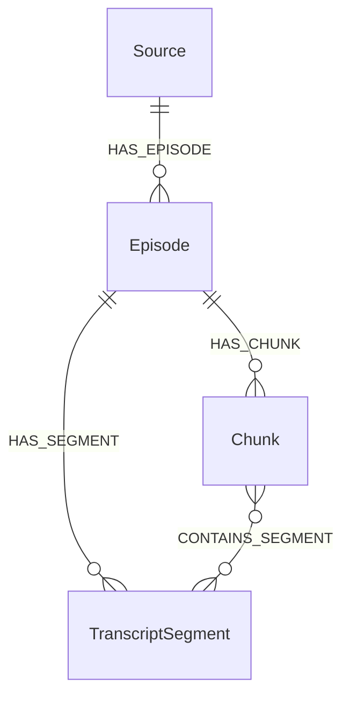

# Architecture

Resonance Graph is built as a modular local pipeline. The MVP focuses on transcript-first GraphRAG and keeps each stage replaceable.

## Pipeline

1. `youtube.py`
   - Validates approved YouTube input at the tool boundary.
   - Downloads videos with `yt-dlp`.
   - Stores source metadata and info JSON.
   - Discovers long-form channel videos while excluding Shorts.

2. `audio.py`
   - Extracts normalized 16 kHz mono WAV audio.
   - Uses system FFmpeg or the `imageio-ffmpeg` fallback.
   - Reuses cached audio unless force mode is enabled.

3. `transcription.py`
   - Transcribes audio locally.
   - Uses `faster-whisper` by default.
   - Preserves timestamped segment boundaries.

4. `chunking.py`
   - Groups transcript segments into retrieval chunks.
   - Preserves chunk start/end timestamps and source segment IDs.
   - Writes chunk JSON for debugging and cache reuse.

5. `ollama.py`
   - Talks to the local Ollama HTTP API.
   - Creates embeddings for chunks and questions.
   - Calls the configured chat model for answer generation.

6. `neo4j_store.py`
   - Creates constraints, indexes, and the vector index.
   - Upserts `Source`, `Episode`, `TranscriptSegment`, and `Chunk` nodes.
   - Runs vector retrieval and graph overview queries.

7. `retrieval.py`
   - Embeds questions.
   - Retrieves relevant chunks from Neo4j.
   - Formats retrieved context.
   - Generates transcript-grounded answers.

8. `web.py` and `app/static/`
   - Provide the local website and JSON endpoints.
   - Reuse the same pipeline modules as the CLI.

## Graph Model

## Idempotency

The pipeline is designed to resume:

- Downloads are protected by a `yt-dlp` archive.
- Audio, transcripts, chunks, and embeddings are cached on disk.
- Neo4j writes use `MERGE`.
- Constraints prevent duplicate graph entities.

## Extension Points

Near-term extensions should add modules rather than overloading existing ones:

- `frames.py` for frame extraction.
- `ocr.py` for frame text.
- `vision.py` for local vision captions.
- `entities.py` for entity/topic/claim extraction.
- `api.py` for a future FastAPI backend.
- `reranking.py` for retrieval reranking.

The graph can be extended with `Frame`, `Entity`, `Topic`, and `Claim` nodes while preserving the current transcript-first core.
