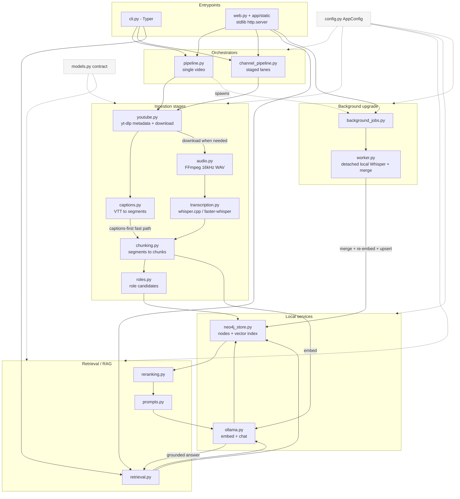
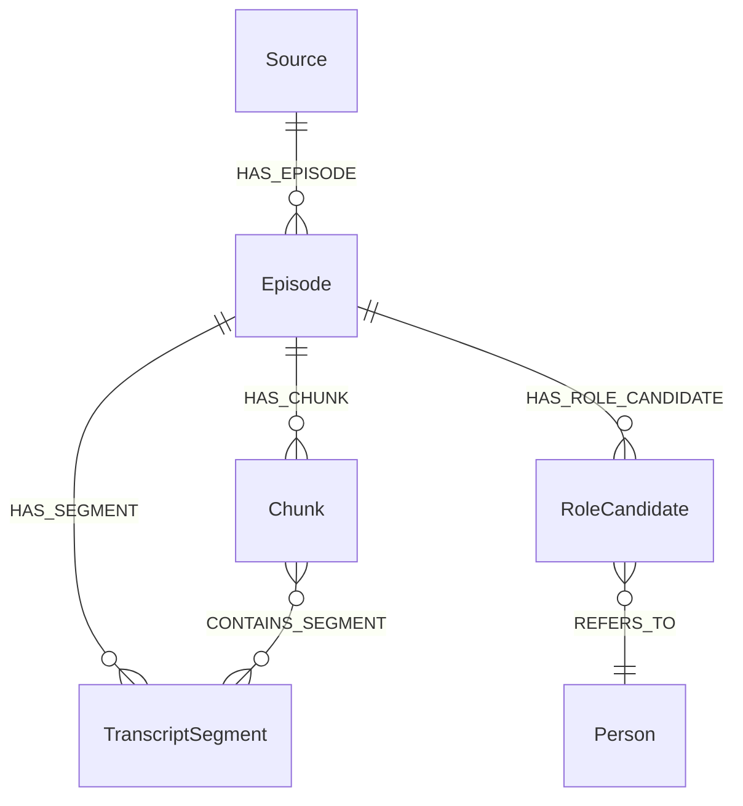

# Architecture

Resonance Graph is built as a modular local pipeline. The MVP focuses on transcript-first GraphRAG and keeps each stage replaceable.

## System Overview

Two thin entrypoints (`cli.py`, `web.py`) delegate to the orchestrators (`pipeline.py` single-video, `channel_pipeline.py` multi-video). `config.py` (`AppConfig`) is threaded through every module; `models.py` pydantic models are the contract between stages. Everything runs locally — Ollama for embeddings/chat, Neo4j for storage. No external LLM API.

Captions-first is the core design: `ingest_url_pipeline` fetches metadata + YouTube captions *before* downloading media, so a video becomes searchable fast, then a higher-quality local Whisper transcript is produced and **merged** in the background (`merge_transcripts` prefers local text, fills gaps with captions). `transcript_source`/`transcript_status` track the pass each chunk came from (`youtube_caption` → `merged`/`local_whisper`).

Two separate job systems, not to be conflated: `background_jobs.py` writes JSON to `data/jobs/` and spawns a detached `python -m app.worker` subprocess that outlives the request; `web.py`'s `JobStore` is a separate in-memory thread tracker for foreground web ingest progress. `/api/background-jobs/*` reads the file system; `/api/jobs/*` reads the in-memory one.

## Pipeline

1. `youtube.py`
   - Validates approved YouTube input at the tool boundary.
   - Fetches public video metadata without media download for the normal captions-first path.
   - Downloads videos with `yt-dlp` only when local audio/transcription is needed.
   - Stores source metadata and info JSON.
   - Discovers long-form channel videos while excluding Shorts.

2. `audio.py`
   - Extracts normalized 16 kHz mono WAV audio.
   - Uses system FFmpeg or the `imageio-ffmpeg` fallback.
   - Reuses cached audio unless force mode is enabled.

3. `transcription.py`
   - Transcribes audio locally.
   - Prefers `whisper.cpp` with Metal on Mac when configured.
   - Uses `faster-whisper` as the fallback local backend.
   - Preserves timestamped segment boundaries.

4. `captions.py`
   - Extracts legally available YouTube captions from public metadata.
   - Prefers manual English captions, then English auto-captions.
   - Parses VTT captions into timestamped transcript segments.

5. `chunking.py`
   - Groups transcript segments into retrieval chunks.
   - Preserves chunk start/end timestamps and source segment IDs.
   - Writes chunk JSON for debugging and cache reuse.

6. `channel_pipeline.py`
   - Runs channel ingestion through bounded stage lanes instead of whole-video parallelism.
   - Makes metadata and caption lookup the first path so caption-backed videos can become searchable before media download.
   - Lets caption lookup, embedding/graph writes, downloads, audio extraction, and local fallback transcription overlap safely.
   - Uses separate worker counts from config so heavy stages remain constrained.

7. `roles.py`
   - Extracts generic role candidates from YouTube metadata, titles, descriptions, and transcript intros.
   - Stores channel/uploader/creator as actual metadata roles, not inferred hosts.
   - Adds `possible_host` and `possible_guest` only when reusable evidence patterns support them.

8. `ollama.py`
   - Talks to the local Ollama HTTP API.
   - Creates embeddings for chunks and questions.
   - Calls the configured chat model for answer generation.

9. `neo4j_store.py`
   - Creates constraints, indexes, and the vector index.
   - Upserts `Source`, `Episode`, `TranscriptSegment`, `Chunk`, `RoleCandidate`, and `Person` nodes.
   - Runs vector retrieval and graph overview queries.

10. `retrieval.py`
   - Embeds questions.
   - Retrieves a wider candidate set from Neo4j, then reranks to the final context count.
   - Can optionally scope retrieval to one episode.
   - Formats retrieved context.
   - Generates transcript-grounded answers.

11. `reranking.py`
   - Reranks vector candidates with local lexical and metadata signals.
   - Uses transcript text plus episode title, channel, uploader, creator, and role candidates.
   - Keeps reranking local and replaceable for a future cross-encoder.

12. `web.py` and `app/static/`
   - Provide the local website and JSON endpoints.
   - Reuse the same pipeline modules as the CLI.

13. `background_jobs.py` and `worker.py`
   - Store detached local transcription job state as JSON under `data/jobs`.
   - Run local Whisper, transcript merge, re-chunking, re-embedding, and Neo4j updates after caption-ready ingest returns.
   - Preserve resumability through cached media, audio, captions, local transcripts, chunks, and embeddings.

## Channel Pipelining

Channel ingestion uses stage pipelining rather than launching full video ingests in parallel. A video first moves through serialized metadata lookup, then caption lookup. When captions exist, it can go straight to chunking, embeddings, and Neo4j without media download. When captions are missing, it enters the media download and local transcription fallback lanes. The default lane sizes are:

- Metadata lane: serialized by design to reduce YouTube throttling pressure.
- Download lane: `PIPELINE_DOWNLOAD_WORKERS=2`, used for local fallback or transcript improvement.
- Audio lane: `PIPELINE_AUDIO_WORKERS=2`
- Caption lane: `PIPELINE_CAPTION_WORKERS=3`
- Ingest lane: `PIPELINE_INGEST_WORKERS=1`
- Local transcription fallback lane: `PIPELINE_LOCAL_WORKERS=1`

This keeps I/O stages moving while protecting Ollama, Neo4j, and local Whisper from uncontrolled contention.

## Graph Model

Role candidates are evidence records, not final truth. A channel/uploader node can answer who published or uploaded a video. Host identity should be answered from `host` or `possible_host` candidates plus their evidence source and confidence.

## Idempotency

The pipeline is designed to resume:

- Downloads are protected by a `yt-dlp` archive.
- Audio, transcripts, chunks, and embeddings are cached on disk.
- Detached local transcription jobs are cached under `data/jobs`.
- Neo4j writes use `MERGE`.
- Constraints prevent duplicate graph entities.

## Extension Points

Near-term extensions should add modules rather than overloading existing ones:

- `frames.py` for frame extraction.
- `ocr.py` for frame text.
- `vision.py` for local vision captions.
- `entities.py` for entity/topic/claim extraction.
- LLM-backed role extraction that emits validated JSON into the existing `RoleCandidate` model.
- `api.py` for a future FastAPI backend.
- Cross-encoder or LLM-backed reranking behind the existing `reranking.py` interface.

The graph can be extended with `Frame`, `Entity`, `Topic`, and `Claim` nodes while preserving the current transcript-first core.
